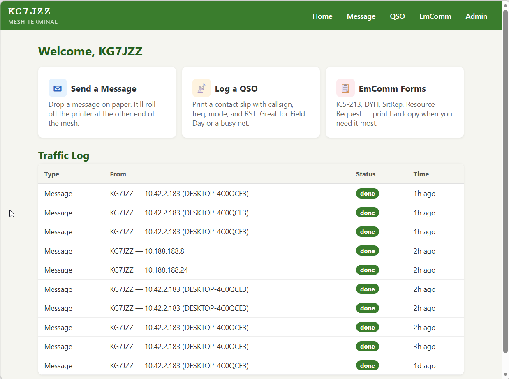
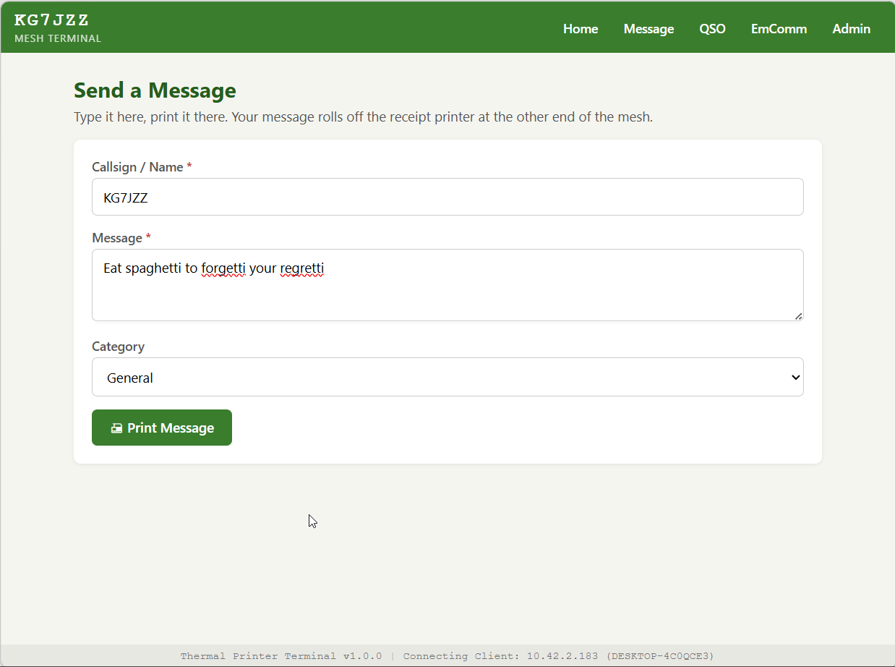
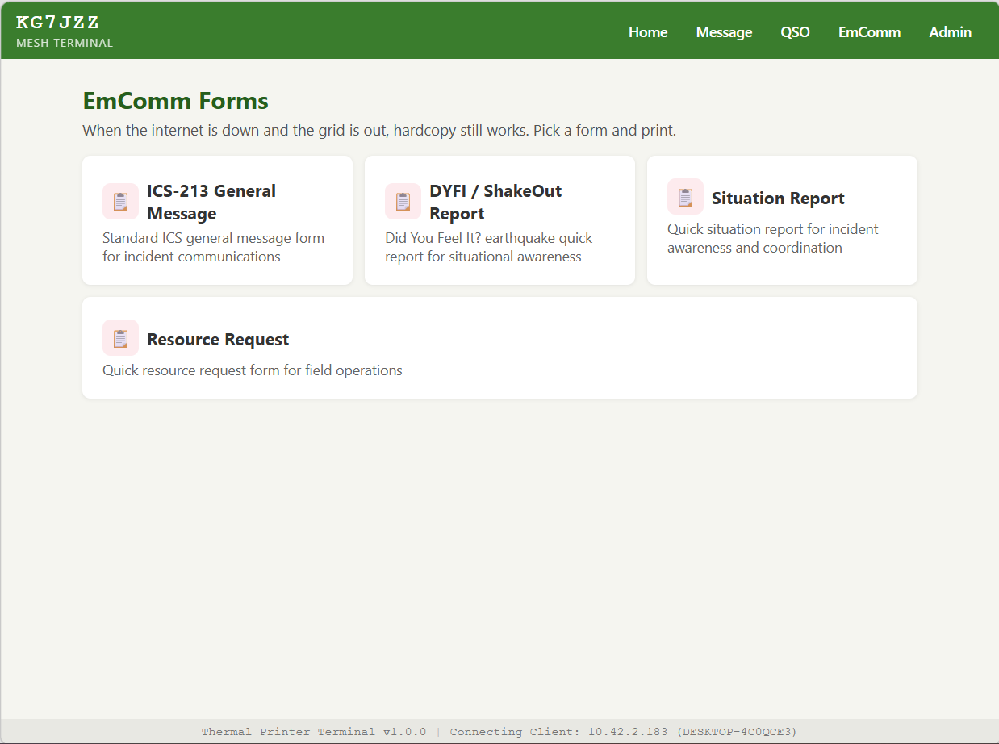
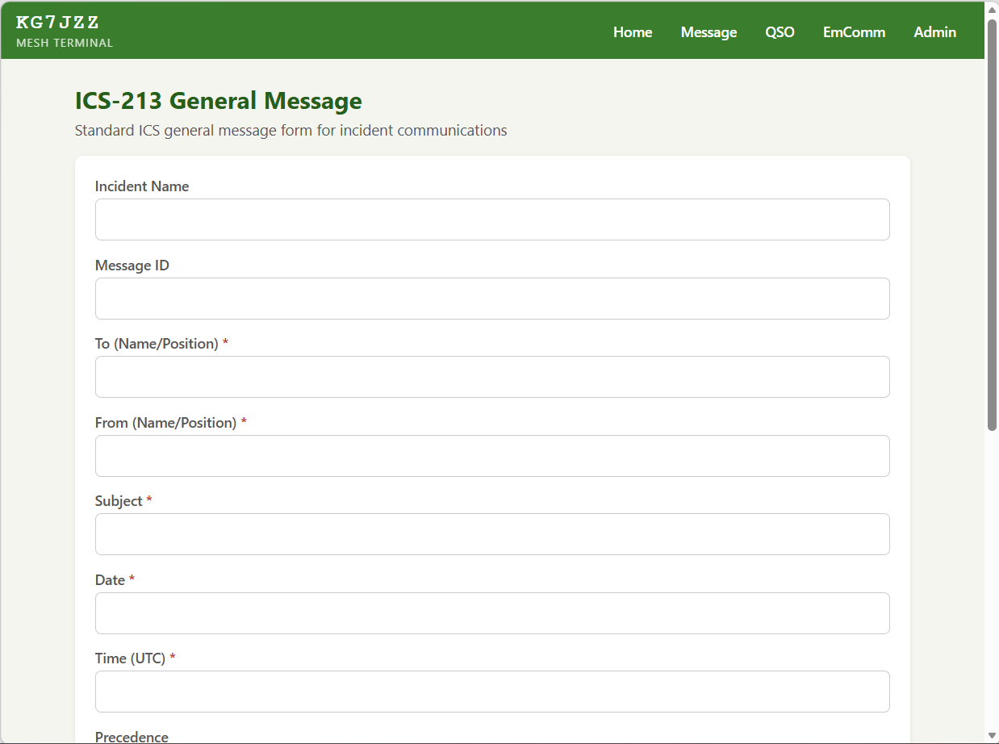
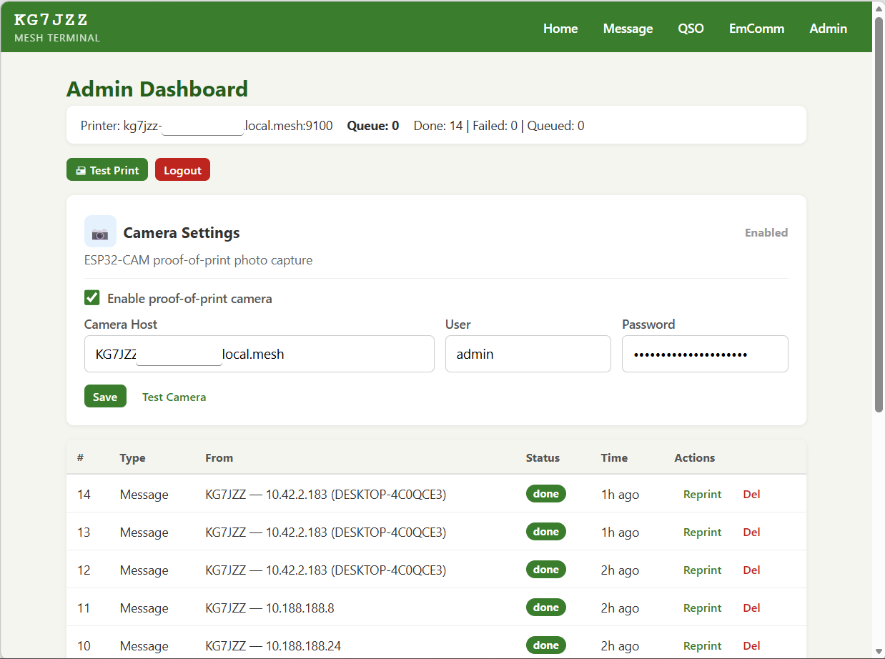
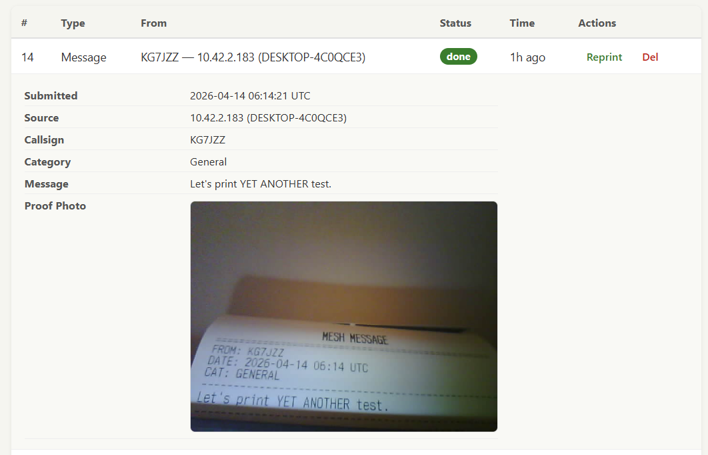

# Thermal Printer Terminal

A lightweight web app that lets users on an [AREDN](https://www.arednmesh.org/) mesh network send print jobs to an Epson TM-m30III thermal receipt printer. Designed for low-bandwidth RF links (tested at 56 kbps) with a total page weight under 10 KB.

Built for amateur radio operators who want hardcopy messages, contact slips, and emergency communications forms at the push of a button.

## Live Demo

A live instance is running on my AREDN mesh node at [kg7jzz-webserver.local.mesh/thermalprinter](http://kg7jzz-webserver.local.mesh/thermalprinter) -- if you're on the mesh, go send something to my printer!

This is a proof-of-concept and I'm actively looking for feedback. If you have ideas for improvements, new features, or things that would make this more useful for your net or EmComm group, please [open an issue](https://github.com/miketweaver/thermal-printer-terminal/issues) or reach out. 73 de KG7JZZ.

## Screenshots

| | |
|---|---|
|  |  |
| Home page with feature cards and traffic log | Send a message to the printer |
|  |  |
| Emergency communications form templates | ICS-213 General Message form |
|  |  |
| Admin dashboard with camera settings and job queue | ESP32-CAM proof-of-print verification |

## Features

- **Send a Message** -- formatted text messages printed on receipt paper
- **QSO / Contact Slip** -- log radio contacts with callsign, frequency, mode, and RST
- **EmComm Forms** -- ICS-213, DYFI, Situation Report, and Resource Request
- **Admin Dashboard** -- view queue, reprint/delete jobs, test printer connectivity
- **Proof-of-Print Camera** -- optional ESP32-CAM integration captures a photo of each printed receipt
- **Background Queue** -- SQLite-backed print queue with automatic retry
- **Direct ESC/POS** -- raw TCP to port 9100, no CUPS or drivers needed
- **Unicode Safety** -- smart quotes, accented characters, and other Unicode are automatically translated to printer-safe ASCII

## Quick Start

```bash
# Create virtual environment
python -m venv .venv
source .venv/bin/activate  # Linux/Mac
# .venv\Scripts\activate   # Windows

# Install dependencies
pip install -r requirements.txt

# Copy and edit config
cp .env.example .env
# Edit .env -- at minimum set ADMIN_PASSWORD and SECRET_KEY

# Run
uvicorn app.main:app --host 0.0.0.0 --port 8080
```

The app will be available at `http://localhost:8080/thermalprinter/`.

Jobs will queue as "failed" until a printer is reachable -- that's expected for local development.

## Test Printer Connectivity

```bash
# Send a test page directly (no web server needed)
python test_print.py --host <printer-ip-or-hostname>

# Dry run -- hex dump without sending
python test_print.py --dry-run

# Custom message
python test_print.py --text "Hello from the mesh!"
```

## Deploy to an AREDN Node

The included `deploy.sh` (Linux/macOS, requires `rsync`) pushes to a remote node:

```bash
./deploy.sh              # default: root@10.42.10.41
./deploy.sh root@mynode  # custom target
```

It will rsync files, create a virtualenv, install dependencies, and start the systemd service.

## Configuration

All settings come from environment variables or a `.env` file:

| Variable | Default | Description |
|----------|---------|-------------|
| `PRINTER_HOST` | `printer.local.mesh` | Printer hostname or IP |
| `PRINTER_PORT` | `9100` | Raw TCP socket port |
| `PRINTER_TIMEOUT` | `5` | TCP timeout in seconds |
| `PRINTER_RETRY_MAX` | `2` | Retry attempts per job |
| `ENABLE_CUT` | `true` | Auto-cut after each print |
| `PAPER_WIDTH_CHARS` | `48` | Receipt column width (characters) |
| `NODE_CALLSIGN` | `NOCALL` | Station callsign shown in header |
| `ADMIN_PASSWORD` | `changeme` | Admin dashboard password |
| `SECRET_KEY` | *(random string)* | Cookie signing secret -- **change this** |
| `DATABASE_PATH` | `data/printqueue.db` | SQLite database path |
| `MAX_QUEUE_SIZE` | `100` | Maximum queued jobs before rejecting |
| `MAX_MESSAGE_LENGTH` | `1000` | Maximum message body characters |

Camera settings (host, credentials, enable/disable) are configured through the admin dashboard UI.

## Architecture

```
Browser --> FastAPI (Jinja2 HTML) --> SQLite Queue --> Background Worker --> TCP:9100 --> Printer
                                                             |
                                                     ESP32-CAM (optional)
                                                     proof-of-print photo
```

- **FastAPI + Jinja2** -- server-rendered HTML, no JavaScript frameworks
- **SQLite via aiosqlite** -- async print job queue with status tracking
- **Background async worker** -- polls queue, sends ESC/POS bytes, one job at a time
- **Direct TCP socket** -- raw ESC/POS to port 9100, no CUPS/LPR/drivers
- **Cookie-based admin auth** -- signed with `itsdangerous`, 24-hour sessions

## Project Structure

```
app/
  main.py              # FastAPI app, lifespan, router mounts
  config.py            # Pydantic settings from .env
  db.py                # SQLite schema and CRUD
  models.py            # Pydantic validation models
  printer.py           # ESC/POS commands + TCP transport
  queue_worker.py      # Background print worker
  templates_engine.py  # Receipt byte renderers
  camera.py            # ESP32-CAM capture (optional)
  text_utils.py        # Unicode-to-ASCII sanitization
  helpers.py           # Shared display helpers
  web.py               # Templates, auth, flash, cookies
  theme.py             # DNS resolution, callsign parsing
  rate_limit.py        # In-memory rate limiter
  pages/               # Route handlers (home, message, qso, emcomm, admin)
  templates/           # Jinja2 HTML templates
  static/              # CSS
test_print.py          # Standalone CLI printer test
deploy.sh              # rsync deploy script (Linux/macOS)
thermalprinter.service # systemd unit file
```

## API

All print endpoints accept standard `application/x-www-form-urlencoded` POST data. On success they return a `303` redirect (which browsers follow automatically). To use them programmatically with `curl`, add `-L` to follow the redirect or use `-o /dev/null` if you only care about the status code.

All routes are prefixed with `/thermalprinter` by default.

### Send a Message

```
POST /thermalprinter/message
```

| Field | Required | Description |
|-------|----------|-------------|
| `callsign` | yes | Your callsign (1-15 chars, alphanumeric) |
| `body` | yes | Message text (max 1000 chars) |
| `category` | no | `general` (default), `emergency`, `weather`, `net-control`, `info`, `social` |

```bash
curl -X POST http://your-node.local.mesh/thermalprinter/message \
  -d "callsign=W1AW" \
  -d "body=Hello from the mesh!" \
  -d "category=general"
```

### Log a QSO

```
POST /thermalprinter/qso
```

| Field | Required | Description |
|-------|----------|-------------|
| `callsign` | yes | Your callsign (1-15 chars, alphanumeric) |
| `date` | yes | Date (e.g. `2025-07-04`) |
| `time_utc` | yes | Time in UTC (e.g. `14:30`) |
| `frequency` | yes | Frequency (e.g. `146.520 MHz`) |
| `mode` | no | `SSB` (default), `FM`, `AM`, `CW`, `FT8`, `FT4`, `DMR`, `DSTAR`, `C4FM`, `RTTY`, `PSK31`, `JS8`, `WINLINK`, `OTHER` |
| `station_worked` | no | Callsign of station worked (max 15 chars) |
| `signal_sent` | no | RST sent (e.g. `59`) |
| `signal_received` | no | RST received |
| `notes` | no | Free text (max 500 chars) |

```bash
curl -X POST http://your-node.local.mesh/thermalprinter/qso \
  -d "callsign=W1AW" \
  -d "date=2025-07-04" \
  -d "time_utc=14:30" \
  -d "frequency=146.520 MHz" \
  -d "mode=FM" \
  -d "station_worked=W7ABC" \
  -d "signal_sent=59" \
  -d "signal_received=57"
```

### Submit an EmComm Form

```
POST /thermalprinter/emcomm/{template_type}
```

`template_type` is one of: `ics213`, `dyfi`, `sitrep`, `resource_request`

Fields vary by template. All fields are submitted as flat form data using the field name directly.

**ICS-213 General Message:**

| Field | Required |
|-------|----------|
| `to_field` | yes |
| `from_field` | yes |
| `subject` | yes |
| `date` | yes |
| `time` | yes |
| `body` | yes |
| `incident_name` | no |
| `msg_id` | no |
| `precedence` | no (`Routine`, `Priority`, `Immediate`, `Flash`) |
| `approved_by` | no |
| `reply` | no |

```bash
curl -X POST http://your-node.local.mesh/thermalprinter/emcomm/ics213 \
  -d "to_field=EOC" \
  -d "from_field=W1AW" \
  -d "subject=Status Update" \
  -d "date=2025-07-04" \
  -d "time=14:30" \
  -d "body=All stations reporting normal operations."
```

**DYFI / ShakeOut Report:** `location`, `date`, `time`, `intensity` (1-10 Mercalli), `description`, `reporter` (required); `duration`, `damage`, `injuries` (optional)

**Situation Report:** `reporting_station`, `dtg`, `situation_summary`, `reporter` (required); `period_from`, `period_to`, `resources_needed`, `casualties`, `infrastructure`, `next_report` (optional)

**Resource Request:** `requesting_station`, `date`, `time`, `resource_type`, `quantity`, `priority`, `delivery_location`, `poc_name`, `justification` (required); `poc_contact` (optional)

### Rate Limiting

Print submissions are rate-limited per client IP. If you hit the limit you'll get a `200` response with the form re-rendered and a warning message. There is no `Retry-After` header -- just wait a bit.

### Queue Full

If the print queue is at capacity (`MAX_QUEUE_SIZE`, default 100), submissions return `200` with an error message instead of enqueueing.

## Printer Compatibility

Built for the **Epson TM-m30III** but should work with any ESC/POS-compatible thermal receipt printer that accepts raw TCP connections on port 9100. The following ESC/POS commands are used:

- `ESC @` (initialize), `ESC E` (bold), `ESC a` (alignment)
- `GS !` (character size), `GS V` (paper cut)
- `ESC d` (feed lines)

## License

MIT
